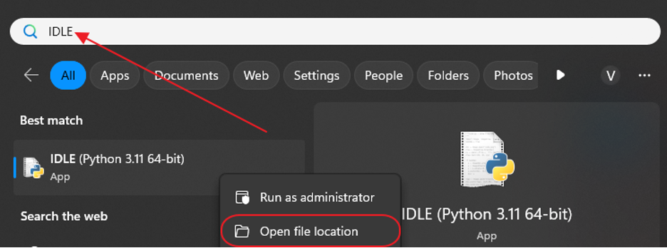
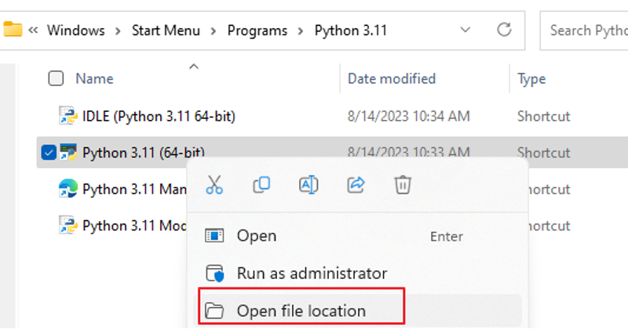
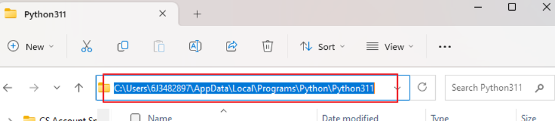
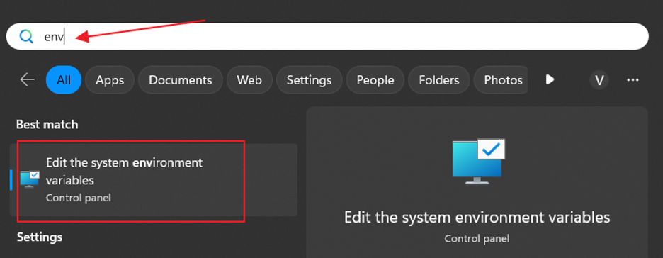
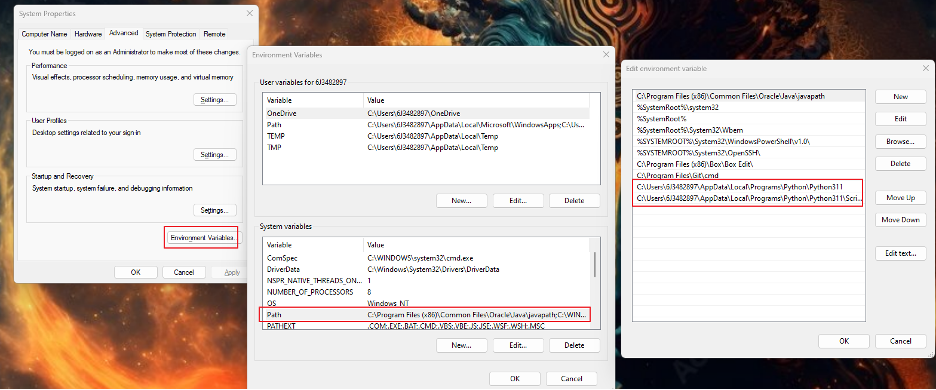
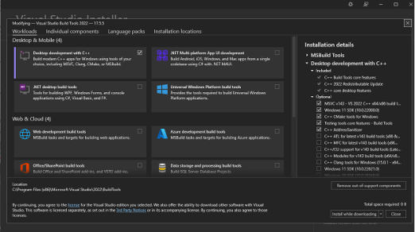
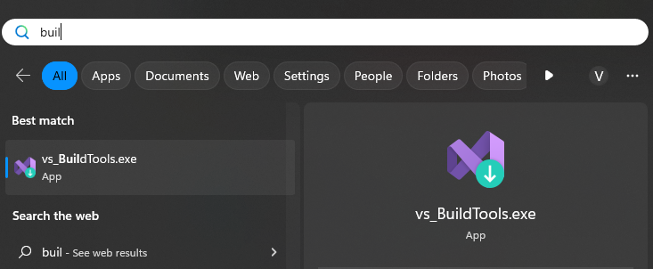
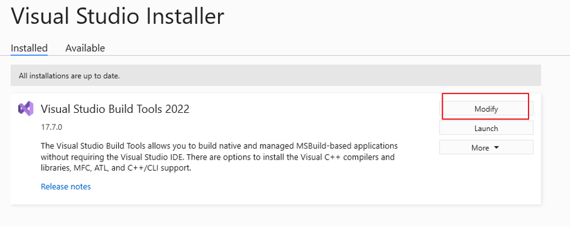
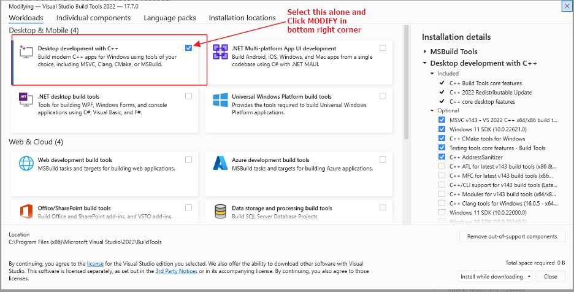
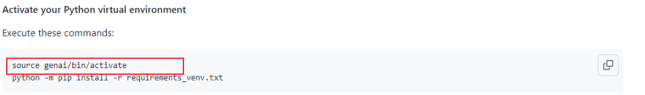

**在 Windows 中建立虛擬環境**

### 在建立虛擬環境之前，請完成以下步驟： 

1. 找到你的Python資料夾路徑
在 Windows 搜尋列中搜尋“IDLE”
<br><br>
點擊 python 3.11（或您的 python 版本）上的“開啟檔案位置”
<br><br>
複製文件位置
<br><br>
2.確保Python已加入路徑中
在 Windows 搜尋列中輸入“env”，然後按一下“編輯系統環境變數”
<br><br>
現在按一下“環境變數”>>“路徑”，如果 Python311 尚不存在，請按一下“新建”。如果您單擊“新建”，只需貼上您之前複製的檔案位置即可。
<br><br>
3.安裝Microsoft C++建置工具

* 前往[此頁面](https://visualstudio.microsoft.com/visual-cpp-build-tools/)
* 點擊「下載建置工具」並執行下載的文件
* 按一下「安裝」（應顯示一個具有不同選項的視窗）
* 僅選擇“使用C++進行桌面開發”>>“安裝”
<br><br>
* 重新啟動您的系統
* 如果之前已經安裝了Microsoft C++ Build Tools，則需要修改
* 在Windows搜尋列中搜尋“建置工具”
<br><br>
* 點選“Visual Studio Build Tools 2022”上的“修改”
<br><br>
* 現在選擇“用C++進行桌面開發”，再次點擊右下角的“修改”
<br><br>

### 現在，請按照以下步驟建立您的虛擬環境：

#### 升級 Python v3.11 以避免任何衝突
升級 Python 版本可能很複雜，因此在過程中不要害怕尋求協助。我們已記錄了最佳實踐來為您提供幫助。使用 Python 3.8 plus 可能沒有任何問題，但請記住，即使 Python 3.9 也已經有 2.5 歲了。 [按照這些最佳實踐升級到 Python 3.11](upgrade-python.md)。

#### 建立您的 Python 虛擬環境
建立一個資料夾，您將在其中建立和儲存 Python 虛擬環境。然後打開終端機/控制台視窗並輸入以下命令來建立名為“venv”的 Python 環境。新的虛擬環境將產生一個同名的本機目錄。
```
cd <directory to store your Python environment>
python3 -m venv .venv
```

#### 下載requirements_venv.txt
下載 [requirements_venv.txt](./requirements_venv.txt)，其中包含要在您的環境中安裝的初始軟體包的清單。在執行命令之前，將requirements.txt 檔案移至您為Python 環境建立的資料夾。請注意，需求檔案應該已經從先前克隆的儲存庫中下載！

#### 啟動您的Python虛擬環境
執行以下命令在 Windows 上啟動您的環境並安裝所需的庫：

```
.\genai\Scripts\activate
```

注意，上面的命令是根據Mac用戶的說明修改的，如下所示：
<br><br>
接下來，只需使用以下命令安裝所需的庫：

```
python -m pip install -r requirements_venv.txt
```

您可以透過查看終端機/控制台視窗中提示行的開頭來驗證您的環境是否處於活動狀態。如下所示，Commandline 的開頭會變更為 show (venv)。

<p align="left">
  
</p>